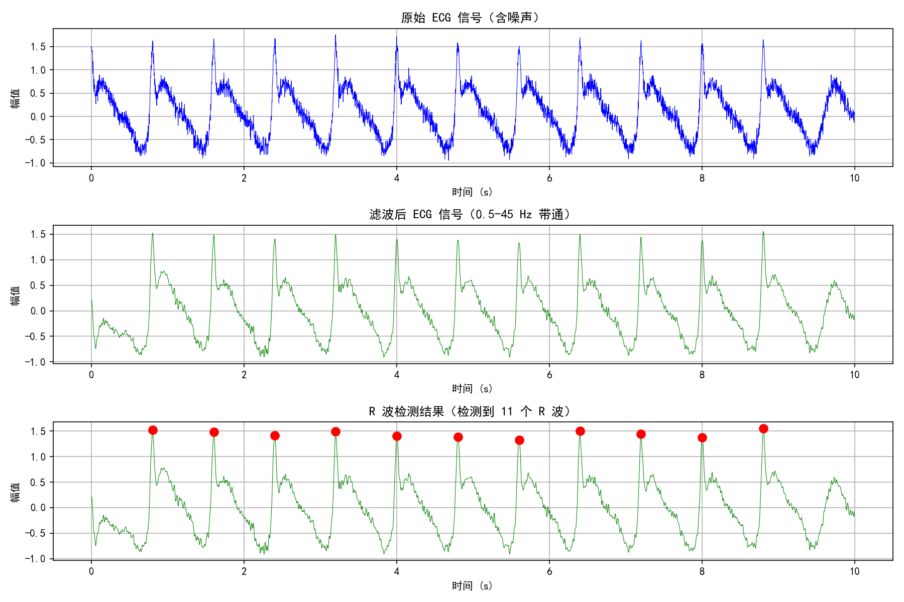
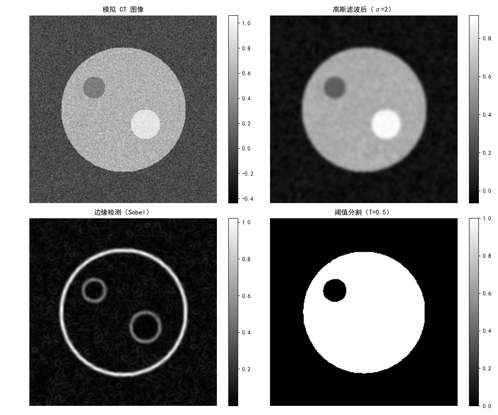
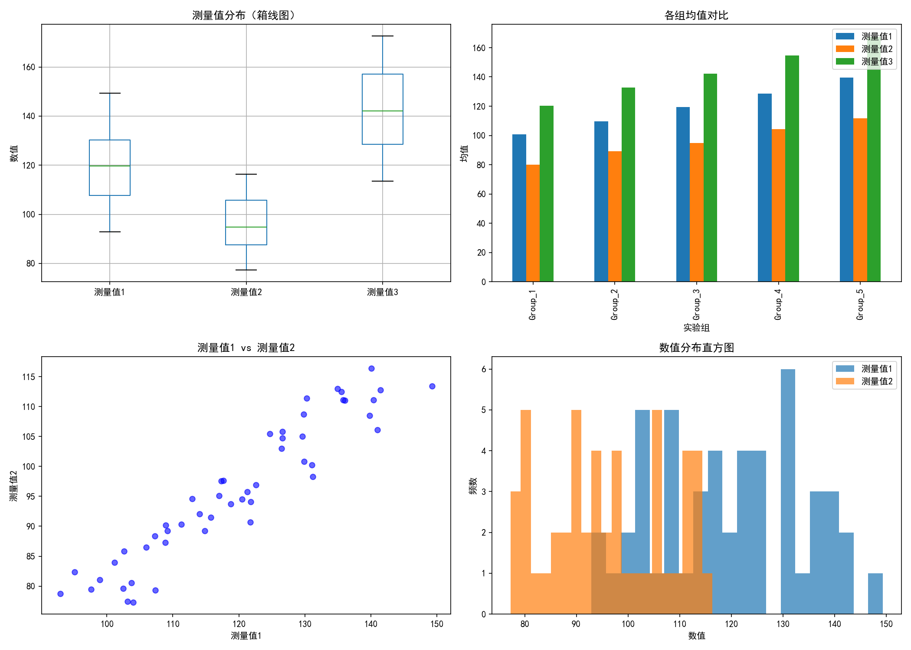
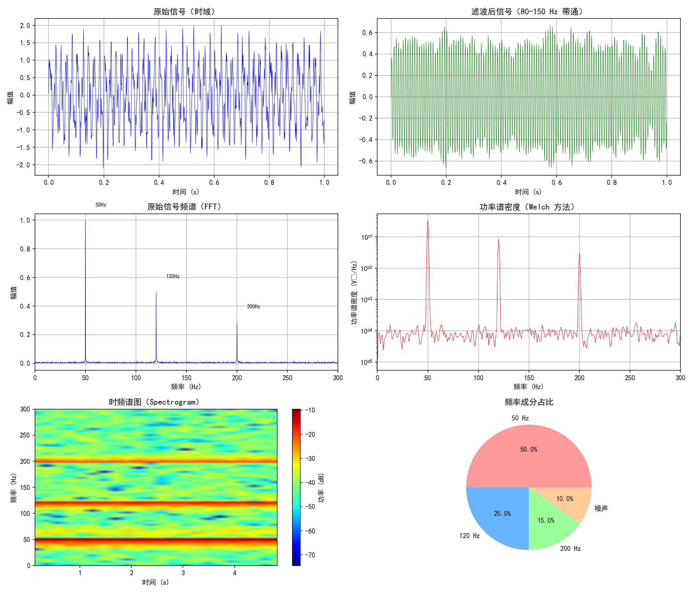

# Medical Data Processing Demo

一个全面的医学/生物医学数据处理示例项目集合，展示 Python 在医学数据分析中的多种应用场景。


## 🎯 项目概览

| Demo | 文件 | 展示能力 |
|------|------|---------|
| 心电图处理 | `ecg_processing.py` | 信号处理、R波检测、心率分析 |
| 医学图像处理 | `medical_image_processing.py` | 图像滤波、边缘检测、分割 |
| 实验数据分析 | `experiment_data_analysis.py` | 批量数据处理、统计报告 |
| 频谱分析 | `spectrum_analysis.py` | FFT、功率谱密度、时频分析 |

---

## 📊 Demo 运行结果

### 1. ECG 心电图处理



**功能：**
- 模拟 ECG 信号生成（心率 75 bpm）
- 带通滤波（0.5-45 Hz）
- R 波自动检测
- 心率计算

**运行结果：**
- 检测到 R 波数量: 11
- 平均 RR 间期: 799.7 ms
- 估算心率: 75.0 bpm

---

### 2. 医学图像处理



**功能：**
- 模拟 CT 图像生成（含噪声）
- 高斯滤波去噪
- Sobel 边缘检测
- 阈值分割

**运行结果：**
- 图像尺寸: 256 × 256
- 分割区域面积: 20886 像素

---

### 3. 实验数据自动化



**功能：**
- 批量数据读取（CSV/Excel）
- 统计分析（均值、标准差、变异系数）
- 分组分析
- 自动报告生成

**输出文件：**
- `experiment_data.csv` - 原始数据
- `experiment_results.png` - 可视化图表
- `analysis_report.txt` - 统计报告

---

### 4. 信号频谱分析



**功能：**
- 多频率信号生成（50/120/200 Hz）
- FFT 快速傅里叶变换
- 功率谱密度（Welch 方法）
- 时频谱图（Spectrogram）

**检测结果：**
- 50.0 Hz, 幅值: 0.995
- 120.0 Hz, 幅值: 0.496
- 200.0 Hz, 幅值: 0.283

---

## 🛠️ 技术栈

| 库 | 用途 |
|---|------|
| NumPy | 数值计算 |
| SciPy | 科学计算、信号处理 |
| Matplotlib | 数据可视化 |
| Pandas | 数据处理、统计分析 |

---

## 🚀 快速开始

### 安装依赖

```bash
pip install numpy scipy matplotlib pandas
```

### 运行各个 Demo

```bash
# ECG 信号处理
python ecg_processing.py

# 医学图像处理
python medical_image_processing.py

# 实验数据分析
python experiment_data_analysis.py

# 频谱分析
python spectrum_analysis.py
```

---

## 💼 应用场景

本项目涵盖的技术可应用于：

- 🏥 医疗仪器数据分析
- 🧪 实验室数据处理自动化
- 💓 生物医学信号处理（ECG、EEG、EMG）
- 🖼️ 医学影像预处理
- 📡 传感器数据分析

---

## 📝 技术亮点

| 技术 | 说明 |
|------|------|
| 数字滤波 | Butterworth 带通滤波器设计 |
| 峰值检测 | 基于阈值的 R 波自动检测 |
| 图像处理 | 高斯滤波、Sobel 边缘检测、阈值分割 |
| 频域分析 | FFT、功率谱密度、时频分析 |
| 数据自动化 | 批量处理、自动报告生成 |

---

## 👤 作者

**背景：** 生物医学工程 + 物理实验教师

**专注：** 医学数据处理、信号分析、自动化工具开发

---

## 📜 许可证

MIT License

---

欢迎 Star ⭐ 和 Fork！如有问题欢迎提 Issue。